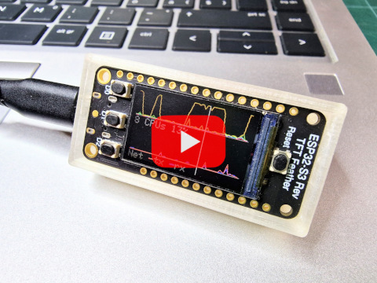
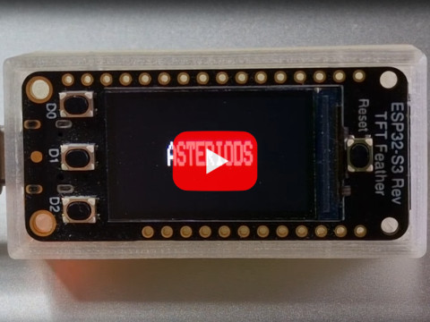
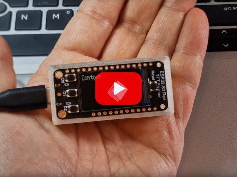

# Arduino ESP32 TFT Terminal

(Using Adafruit ESP32-S2 Reverse TFT Feather.)

This repository provides the code needed to implement a gadget
sporting a small TFT display, enclosed in a 3D-printed case, and
driven by a program running on your computer (in Python, developed and
tested on Linux).

It provides apps like performance monitors, games and various demos,
and is extensible.


## A. Project motivation

The Adafruit ESP32-S2 Reverse TFT Feather is an awesome little board
consisting of an ESP32-based Arduino and a 240x135 color TFT display
on the back side. See https://www.adafruit.com/product/5345.

Wanting first to get one, then to do something with it, I first
implemented an external CPU and network monitor gadget for my
computer. Quickly impressed by the TFT quality, I ended up
implementing various neat apps:

- Performance monitors for local or remote computers
- Asteriod game
- Particles physics simulation
- 3D cube

and others.

## B. Project parts

### 1. case-esp32s3-rtft/

A 3D-printed case and cap, designed in OpenSCAD.

### 2. server-esp32s3-rtft/

An Arduino sketch, implementing a graphical server running on the
board and providing TFT graphical primitives, and buttons readout.

It has been successfully built and uploaded using VS Code, see
`README-VSCODE.md`.

### 3. client-py/

A Python program running on Linux and communicating with the board
over USB, implementing various apps:

  - asteriods
  - bubbles-air
  - bubbles-soap
  - collisions-elastic
  - collisions-gravity
  - cube
  - fill
  - monitor-cpus
  - monitor-graph
  - monitor-host
  - quix
  - starfield
  - tunnel

To run it, do:
```
cd client-py
./run.py -h
```

To create a new app, study `app/quix.py`, create a new module and
class, and register your new class in `run.py`.

## C. Videos on Youtube

|            |             |             |
|------------|-------------|-------------|
| [](https://youtu.be/Nq5qLFQl3gA) | [](https://youtu.be/HaPi0cx6-W8) | [](https://youtu.be/vNK-JPLklLs) | |

## D. Photos
|            |             |
|------------|-------------|
|  |  |
|  |  |
|  |  |
|  |  |
|  |  |
